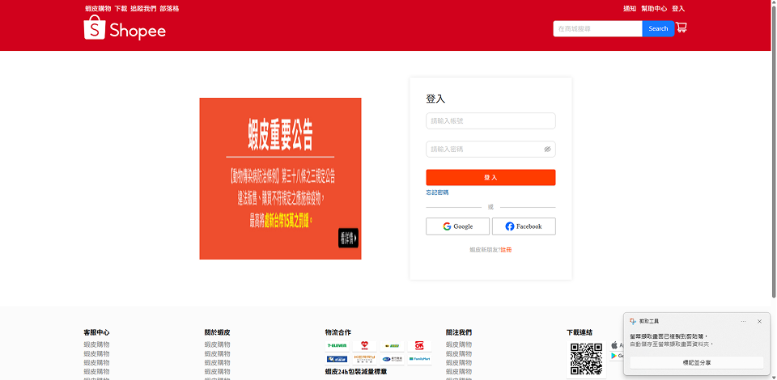
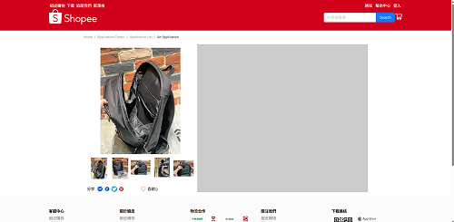

#蝦皮電商網站練習專案
這是一份用來總結課程的實戰練習，主題是模仿蝦皮購物網，目的是實際應用課程所學技術。

**專案狀態**:仍在進行中

###線上預覽[https://kai19971128.github.io/ShopeePractice/]
https://kai19971128.github.io/ShopeePractice/

##專案截圖

##透過這個專案，我練習了:
    1.前端路由規劃
    2.網頁切版
    3.響應式網頁設計(RWD)
    4.JavaScript邏輯編寫
    5.元件模組化

##主要功能
    1.使用者登入
    2.商品瀏覽
    3.商品詳情展示
    4.響應式網頁設計

##使用技術
**前端(Frontend):
    * React(v19)
    * Vite(建置工具)
    * React Router(v7)
    * JavaScript(ES6+)
    * HTML5
    * CSS3
**樣式與設計工具:
    * Ant Design
    * Styled Components
    * Figma
**版本控制:
    * Git&Github
**部署
    * Github Pages
**其他工具:
    * Gemini
